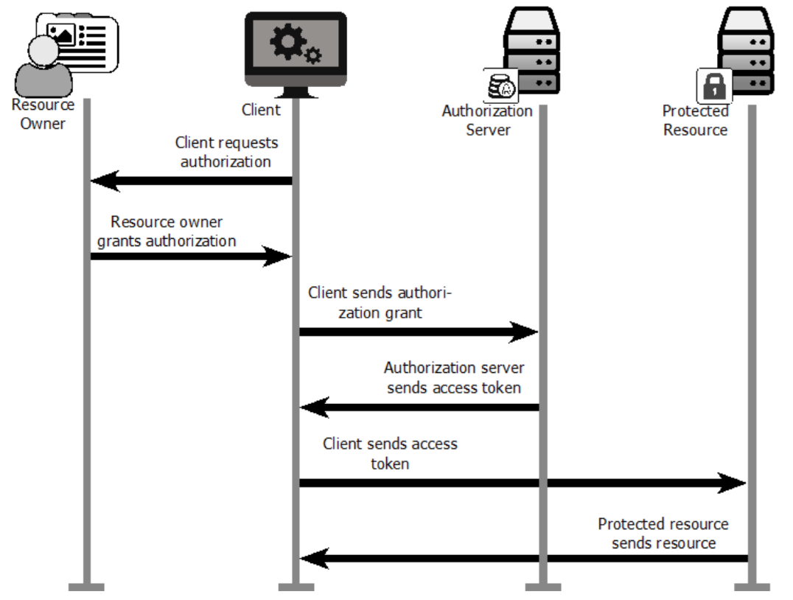

#OAuth

> OAuth is an open standard for authorization, commonly used as a way for Internet users to log into third party websites using their Microsoft, Google, Facebook or Twitter accounts without exposing their password.[1] Generally, OAuth provides to clients a 'secure delegated access' to server resources on behalf of a resource owner. It specifies a process for resource owners to authorize third-party access to their server resources without sharing their credentials. Designed specifically to work with Hypertext Transfer Protocol (HTTP), OAuth essentially allows access tokens to be issued to third-party clients by an authorization server, with the approval of the resource owner. The third party then uses the access token to access the protected resources hosted by the resource server. [WikiPedia](https://en.wikipedia.org/wiki/OAuth)

- [Using OAuth 2.0 to Access Google APIs](https://developers.google.com/identity/protocols/OAuth2)
- [http://oauth.net/](http://oauth.net/)

#reference:

- OAuth 2 in Action version 5

