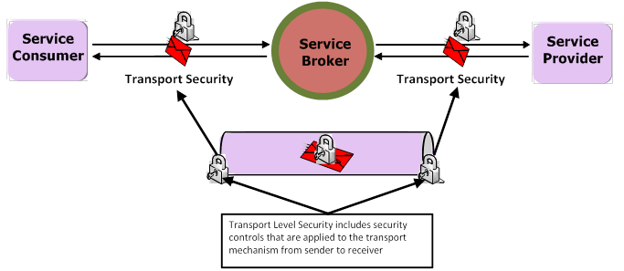
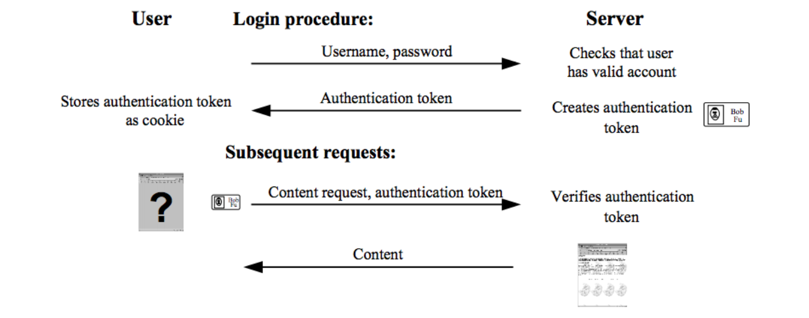

# Information Security

> Information security, sometimes shortened to InfoSec, is the practice of defending information from unauthorized access, use, disclosure, disruption, modification, perusal, inspection, recording or destruction.
> [wikipedia: InfoSec](https://en.wikipedia.org/wiki/Information_security)

ISO security architecture definition:

> “The term security is used in the sense of minimizing the vulnerabilities of assets and resources. An asset is anything of value. A vulnerability is any weakness that could be exploited to violate a system or the information it contains. A threat is a potential violation of security.”

Traditional definitions of information security are based on three information security goals:

- **Confidentiality**: preventing unauthorised disclosure of information
- **Integrity:** preventing unauthorised (accidental or deliberate) modification or destruction of information
- **Availability:** ensuring resources are accessible when required by an authorised user.

### Passive Threats
Passive Threats do not alter information in the system. Such threats may be hard to detect.

**Eavesdropping**

- the attacker monitors the communication.
    - for example by sniffing packets or tapping a telephone wire.

**Traffic analysis**

- The attacker monitors the amount, source and destination of communication.

### Active threats
Active threats alter information in the system. Such threats may be hard to detect. 

- **Masquerade**:   the attacker claims to be a different entity.
- **Replay**:       the attacker sends a message which has already been sent.
- **Modification of messages**: the attacker changes messages during transmission.
- **Denial of service**:        the attacker prevents legitimate users from accessing resources.

### Security service
A processing or communication service to give a specific kind of protection to system resources.

- **Peer entity authentication** provides confirmation of the claimed identity of an entity.
- **Data origin authentication** provides confirmation of the claimed source (origin) of a data unit (message).
- **Access control** provides protection against unauthorized use of resources. 
    - Access control service is usually provided in combination with **authentication & authorisation** services.
- **Data confidentiality** protects data against unauthorised disclosure. 
- **Traffic flow confidentiality** protects disclosure of data which can be derived from knowledge of traffic flows.
- **Data integrity** detects any modification, insertion, deletion or replay of data in a message or a stream of messages.
- **Non-repudiation protects against any attempt by the creator of a message to falsely deny creating the data or its contents**
- **Availability** service protects a systems against denial of service. 

### Security mechanism
A method of implementing one or more security services.

- **Encipherment** is the transformation of data in order to hide its information content.
- **Digital signature** mechanisms are cryptographic algorithms which transform data suing a signing key. the signature is usually appended to the signed data. The essential property is that the signed data cannot be created without the signing key.
- **Access control** 
    - access control lists, passwords, or tokens, which may be used to indicate access rights.
- **data integrity**
    - "corruption detection techniques" which can be used with "sequence information"
- **Authentication exchange** protocols which exchange information to ensure identity of protocol participants. 
    - example: TLS
- **Traffic padding** is spurious traffic generated to protect against traffic analysis.
    - traffic padding is typically used in combination with encipherment.
- **Routing control** mechanism is the use of specific secure routes.
- The **notarization** mechanism uses a trusted third party to assure the source or receipt of data.
    - the trusted third party is sometimes called a notary.

#### Relating security services to mechanisms

|Service \ mechanism         |encipherment   |digital signature  |access control |data integrity |Auth. exchange |padding    |routing control    |notarization   |
|---                         |---            |---                |---            |---            |---            |---        |---                |---            |
|Peer entity authentication  |y              |y                  |               |               |y              |           |                   |               |
|Data origin authentication  |y              |y                  |               |               |               |           |                   |               |
|Access control              |               |                   |y              |               |               |           |                   |               |
|Data confidentiality        |y              |                   |               |               |               |           |y                  |               |
|Traffic Flow Confidentiality|y              |                   |               |               |               |y          |y                  |               |
|Data Integrity              |y              |y                  |               |y              |               |           |                   |               |
|Non repudiation             |               |y                  |               |y              |               |           |                   |y              |
|Availability                |               |                   |               |y              |y              |           |                   |               |

### Risk management
A key tool in information security management

1. Identity threats 
2. Classify all threats according to likelihood and severity
3. Apply security controls based on cost benefit analysis

### Authentication

- 身份验证
- Verifying that the user is who she claims to be.

> is the act of confirming the truth of an attribute of a single piece of data (a datum) claimed true by an entity. In contrast with identification which refers to the act of stating or otherwise indicating a claim purportedly attesting to a person or thing's identity, authentication is the process of actually confirming that identity. It might involve confirming the identity of a person by validating their identity documents, verifying the authenticity of a website with a digital certificate, determining the age of an artifact by carbon dating, or ensuring that a product is what its packaging and labeling claim to be. In other words, authentication often involves verifying the validity of at least one form of identification.

> - [wikipedia](https://en.wikipedia.org/wiki/Authentication)

### Authorization (or Access Control)

- 授权
- Granting access to specific resources based on an authenticated user's entitlements.

> or authorisation is the function of specifying access rights to resources related to information security and computer security in general and to access control in particular. More formally, "to authorize" is to define an access policy. For example, human resources staff is normally authorized to access employee records and this policy is usually formalized as access control rules in a computer system. During operation, the system uses the access control rules to decide whether access requests from (authenticated) consumers shall be approved (granted) or disapproved (rejected). Resources include individual files or an item's data, computer programs, computer devices and functionality provided by computer applications. Examples of consumers are computer users, computer programs and other devices on the computer.

> [wikipedia](https://en.wikipedia.org/wiki/Authorization)

### Confidentiality, privacy

- 保密
- Keeping information secret. Accesses a message, for example a Web service request or an email, as well as the identity of the sending and receiving parties in a confidential manner. Confidentiality and privacy can be achieved by encrypting the content of a message and obfuscating the sending and receiving parties' identities.

### Integrity ( and non repudiation)

- 完整
- Making sure that a message remains unaltered during transit by having the sender digitally sign the message. A digital signature is used to validate the signature and provides non-repudiation. The timestamp in the signature prevents anyone from replaying this message after the expiration.

#### Non-repudiation

- 不可抵赖

> non-repudiation implies one's intention to fulfill their obligations to a contract. It also implies that one party of a transaction cannot deny having received a transaction nor can the other party deny having sent a transaction.
> [wikipedia](https://en.wikipedia.org/wiki/Information_security#Non-repudiation)

### Credential

- 凭证
- A credential is an attestation of qualification, competence, or authority issued to an individual by a third party with a relevant or de facto authority or assumed competence to do so.
    - Examples of credentials include academic diplomas, academic degrees, certifications, security clearances, identification documents, badges, passwords, user names, keys, powers of attorney, and so on.
- **Digital credentials** are the digital equivalent of paper-based credentials. Just as a paper-based credential could be a passport, a Driver's license, a membership certificate or some kind of ticket to obtain some service, such as a cinema ticket or a public transport ticket, a digital credential is a proof of qualification, competence, or clearance that is attached to a person. Also, digital credentials prove something about their owner. Both types of credentials may contain personal information such as the person's name, birthplace, birthdate, and/or biometric information such as a picture or a finger print.  

## Transport-level and Application-level Security

Security concepts can be divided into Transport and Application level Security.

### Transport-level Security
Transport-level security secures the communications channel between applications.

> An example of a transport-level security protocol is **Secure Socket Layer (SSL)**, otherwise known as **Transport Layer Security (TLS)**

transport-level data-communication protocol providing:

- Authentication (the communication is established between two trusted parties).
-  Confidentiality (the data exchanged is encrypted).
-  Message integrity (the data is checked for possible corruption).
-  Secure key exchange between client and server.
  
> SSL provides a secure communication channel, however, when the data is not "in transit," the data is not protected. This makes the environment vulnerable to attacks in multi-step transactions. (SSL provides point-to-point security, as opposed to end-to-end security.)

> SSL uses a combination of secret-key and public-key cryptography to secure communications. SSL traffic uses secret keys for encryption and decryption, and the exchange of public keys is used for mutual authentication of the parties involved in the communication.

### Application-level Security

Application-level security complements transport-level security. Application-level security is based on XML frameworks defining message confidentiality, integrity, authenticity (also known as message protection); message structure; trust management and federation.

## practical

#### [OWASP: Guide to Authentication](https://www.owasp.org/index.php/Guide_to_Authentication)

##### Architectural Goals
**All applications should take into account the following architectural and detailed design goals:**

- All applications within your organization SHOULD share a well-debugged and trusted authentication mechanism if possible
- All secured functions and secured resources SHOULD be protected by a common authentication mechanism within the one application
- All applications MUST use the lowest possible privilege service account to access back end systems such as directories, web services, database and message queues
- Credentials SHOULD be transmitted only over encrypted links, particularly weak authentication mechanisms such as passwords
- Credentials MUST be stored after being one-way hashed and salted using acceptable hashing algorithms
- Credential stores SHOULD implement configurable settings for thresholds, lockouts, password complexity and alerts
- Credential stores SHOULD be designed to implement several hashing algorithms as these will be replaced soon and as change is inevitable, your application should plan today for this transition
- Applications SHOULD have the facility to alert the user as to failed login attempts and offer to allow them to change their password (if applicable)
- Applications SHOULD have the facility to notify the user of their last logged in time, and subsequently report a fraudulent login if they disagree with that date and time
- Authentication and registration processes, particularly login failures, SHOULD provide no information as to if an account exists or password or is wrong. A single error message for the end user covering both scenarios is more than adequate
- All pages SHOULD have an effective logout button on every single page in a common location
- Applications SHOULD possess administrative functions to detail and manage never logged in accounts, idle accounts, and accounts that have been administratively- or soft- locked
- Passwords MUST be easily changed. Applications MAY include password strength indicators or provide a random password generator function
- There SHOULD be a logical difference between administrative lockout and failed login lockout, so that re-enabling all users en masse does not unlock administratively locked users
- Medium value applications SHOULD and High value applications MUST provide a mechanism to re-authenticate or transaction sign high value transactions
- Applications MUST protect credentials from common authentication attacks as detailed in the Testing Guide. Following the sections in this chapter will produce such an outcome

**Things not to do:**

- Applications MUST NOT store any secret part of the credential in the clear (passwords or questions and answers if implemented)
- Applications MUST NOT expose the credential in untrusted locations, such as cookies, headers or hidden fields
- Applications MUST NOT implement CAPTCHA as there is case law against them with respect to universal access and ineffective
- Applications MUST NOT implement questions and answers as they are contrary to most privacy regimes and ineffective
- Applications SHOULD NOT rely on infrastructure authentication, such as REFERER headers or the client's DNS or IP address as these can be faked

##### Password Guidelines
**Passwords are intrinsically weak. Therefore, your application should encourage good password practices:**

- Credentials should only traverse encrypted links
- **Store the password in a strongly hashed and salted format to prevent rainbow table attacks.**
- Pass phrases (long passwords over 20 characters in length) should be encouraged
- Short passwords should be prohibited
- Do not force folks to change passwords frequently as this results in the users writing the passwords down insecurely
- Where suitable, try to share the credential with as many low value systems as possible to encourage one single high quality password
- Allow expert users to store strong passwords in approved password managers. Encourage them to use unique random passwords for each service

**Protect passwords**
> Passwords are the primary means of authenticating users on the Web today. It is important that any Web site guard the passwords of its users carefully. This is especially important since users, when faced with many Web sites requiring passwords, tend to reuse passwords across sites.

- Compromise of a password completely compromises a user. A site should never reveal a password to a user.
- A valid user should already know the password; **sending it unnecessarily over the network gives the eavesdropping adversary more opportunity to sniff the password.**
- Do **not store passwords in cleartext in your database**. User databases are routinely hacked, leaked or gleaned through SQL injection, and if you are storing raw, plaintext passwords, that is instant game over for your login security.

- **[stack exchange: How to securely hash passwords?](http://security.stackexchange.com/questions/211/how-to-securely-hash-passwords/31846#31846)**
- **[stack exchange: Token-based authentication - Securing the token](http://security.stackexchange.com/questions/19676/token-based-authentication-securing-the-token)**
- **[stack overflow: How token-based authentication works](http://stackoverflow.com/questions/26777083/best-practice-for-rest-token-based-authentication-with-jax-rs-and-jersey)**

##### CAPTCHA
**CAPTCHA (Completely automated Turing Tests To Tell Humans and Computers Apart) are illegal in any jurisdiction that prohibits discrimination against disabled citizens. This is essentially the entire world. Although CAPTCHAs seem useful, they are in fact, trivial to break using any of the following methods:**

- Optical Character Recognition. Most common CAPTCHAs are solvable using specialist CAPTCHA breaking OCR software.
- Break a test, get free access to foo, where foo is a desirable resource
- Pay someone to solve the CAPTCHAs. The current rate at the time of writing is $12 per 500 tests.
- **Therefore implementing CAPTCHAs in your software is most likely to be illegal in at least a few countries, and worse - completely ineffective.**

### [OAuth](OAuth.md)

#### [stack overflow: The definitive guide to form-based website authentication](http://stackoverflow.com/questions/549/the-definitive-guide-to-form-based-website-authentication/477578#477578)
#### [stack exchange: Why use an authentication token instead of the username/password per request?](http://security.stackexchange.com/questions/63435/why-use-an-authentication-token-instead-of-the-username-password-per-request)
#### [OWASP: Authentication Cheat Sheet](https://www.owasp.org/index.php/Authentication_Cheat_Sheet)
#### [pdf MIT Laboratory for Computer Science: Dos and Don’ts of Client Authentication on the Web](https://pdos.csail.mit.edu/papers/webauth:sec10.pdf)

# reference 

- [docs.oracle: Understanding Web Service Security Concepts](https://docs.oracle.com/middleware/1212/owsm/OWSMC/owsm-security-concepts.htm#OWSMC1508)
- [microsoft: Transport level security](https://msdn.microsoft.com/library/hh323709(v=vs.100).aspx)
- [wikipedia: Information security](https://en.wikipedia.org/wiki/Information_security)
- [wikipedia: Transport Layer security](https://en.wikipedia.org/wiki/Transport_Layer_Security)
- [pdf MIT Laboratory for Computer Science: Dos and Don’ts of Client Authentication on the Web](https://pdos.csail.mit.edu/papers/webauth:sec10.pdf)

## useful links

- [SSL Labs: is a collection of documents, tools and thoughts related to SSL.](https://www.ssllabs.com/index.html)
- [OWASP: the free and open software security community](https://www.owasp.org/index.php/Main_Page)
    - [Top 10 attack](https://www.owasp.org/index.php/Top_10_2013-Top_10)
- [The CrypTool Portal: raises awareness and interest in encryption techniques for everyone. All learning programs in the CrypTool project are open source and available for free.](https://www.cryptool.org/en/)
- [The Computer security Resource Center](csrc.nist.gov)
    - The Computer Security Resource Center (CSRC) facilitates broad sharing of information security tools and practices, provides a resource for information security standards and guidelines, and identifies key security web resources to support users in industry, government, and academia.
- [Handbook of APPLIED CRYPTOGRAPHY](http://cacr.uwaterloo.ca/hac/)
    - Handbook of Applied Cryptography (Discrete Mathematics and Its Applications) 1996
