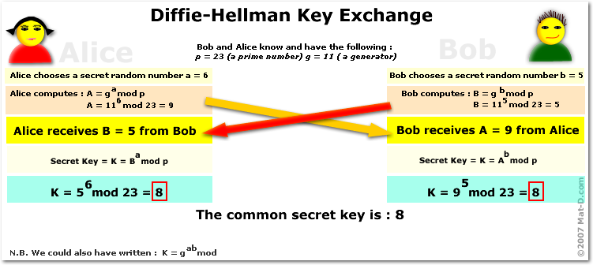
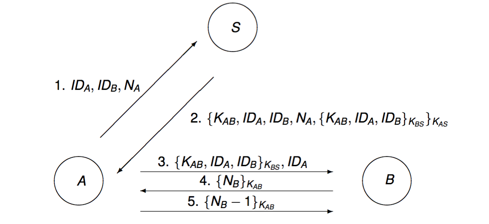

#Information security 
**TTM4135**

###### [quiz](ttm4135.md)

## Classical Encryption

### Confidentiality and authentication

- Cryptography is the science of secret writing. It concerns transformations of data which depend on a secret called the **key**.
- Cryptography can be used to provide confidentiality and to provide authentication (or integrity).
- When used for confidentiality a key is needed in order to read the message. 
- When used for authentication a key is needed in order to write the message. 

### Cryptosystems
A cryptosystem consists of:

- a set of plaintexts: original message. X
- a set of ciphertexts: encrypted message. Y
- a set of keys. K
- a function -> transforms plaintext into ciphertext: encryption or encipherment. E
- an inverse function which transforms ciphertext back into plaintext: decryption or decipherment. D

### Symmetric and asymmetric cryptography

**Symmetric key cipher** (secret key cipher):

- encryption and decryption keys known only to the sender and receiver. 
- Requires a secure channel for transmission of the cryptographic key.

encryption: Y = E(K, X)
decryption: X = D(K, Y)

**Asymmetric key cipher** (public key cipher):

- each participant has a public key and a private key.
- may allow for both encryption of messages and creation of digital signatures.

### Methods of cryptanalysis

#### Exhausitive key search

- the most basic method of attack is **exhaustive key search**, sometimes called **brute-force attack**, 
	- in which the adversary tries all possible keys. 
- we can not prevent this attack
	- so all cryptosystems must have enough keys to make exhaustive search too difficult computationally. 
	- possible to find the key without trying exhausitive search;
	- adversary may be able to break cryptosystem without finding the key. 
- Prevention of exhaustive key search is a minimum standard. 

### Attack classification
In cryptanalysis, attack models or attack types are classification of cryptographic attacks. Common attack models are:

1. Ciphertext Only attack
	- the attacker has available only the intercepted ciphertext. 
2. Known Plaintext attack
	- the attacker knows a small amount of plaintext and its ciphertext equivalent. 
3. Chosen Plaintext attack
	- The attacker can obtain the ciphertext equivalent of some plaintext which can be selected by the attacker;
		- i.e. the attacker has an 'inside encryptor' available. 
4. Chosen Ciphertext attack
	- The attacker can obtain the plaintext equivalent of some ciphertext which can be selected by the attacker
		- i.e. the attacker has an 'inside decryptor' available. 

### kerckhoffs' Principle
**The attacker has complete knowledge of the cipher**
- e.g. the **decryption key** is the only thing unknown to the attacker.
- History has shown that **Kerckhoffs' Principle** is a reasonable assumption.

### Basic cipher operations
Most historical ciphers are based on a combination of two basic operations. Transposition and Substitution.

#### Transposition: 
- the characters in the plaintext are mixed up with each other (permuted).
- transposition cipher permutes characters usually in a fixed period d and permutation f.
	-  we can consider the plaintext as a matrix of rows of length d.
	- generally transposition ciphers can permute rows or columns and output in row or column order. 
- Mathematically a bijective function is used on the characters' positions to encrypt and an inverse function to decrypt. 

###### Cryptanalysing a transposition cipher
- the frequency distribution of the ciphertext characters is the same as for the plaintext characters. 
	- this helps to identify a trransposition cipher. 


#### Substitution:	
- each character (or set of characters) is replaced by a different character (or set of characters).
	- as defined by a substitution table. 
- **transposition** ciphers permute **plaintext characters**
	- the units of the plaintext are rearranged in a different and usually quite complex order, but the units themselves are left unchanged.
- **substitution** ciphers permute **alphabet characters**. 
	- the units of the plaintext are retained in the sequence in ciphertext, but the units themselves are altered. 

### Caesar cipher 
###### Simple Substitution Ciphers
- ###### Caesar cipher
- ###### Random Simple Substitution Cipher

A chipher which moves the ith letter of an alphabet to the i+j th letter. The key is the value j.
- Encryption Ci = (Ai + j) mod n
- Decryption Ai = (Ci - j) mod n
- where n = 26 or n = 27

### Random simple substitution cipher
A cipher which assigns a random character of the alphabet to another character of the alphabet. 

- encryption and decryption are defined by the substitution table which randomly permutes the alphabet. 
- If the alphabet has 26 characters, there are 26! keys (greater than 10^26)
- Caesar cipher is a special case of the random simple substitution cipher. 

### Polyalphabetic substituion
- polyalphabetic substitution ciphers use multiple mappings from plaintext to ciphertext.
- the effect of the multiple alphabets is to smooth the frequency distribution so direct frequency analysis is no longer effective. 

###### Polyalphabetic substitution
- ###### Vigenere cipher

### Vigenere cipher
the vigenere cipher is a popular form of periodic substitution cipher based on shifted alphabets. 

```
M:          AT-T	HE-T	IME-
K:          LOCK	LOCK	LOCK
E(K,M):     LGBC	SSBC	T-GJ
//
(A=0,...Z=25,-=26) 
```

### Hill cipher

- Hill cipher is an example of polygram cipher (polygraphic cipher)
	- is a simple substituion cipher on an extended alphabet consisting of multiple characters. 
- the major weakness of the Hill cipher is that it is linear.
	- makes known plaintext attacks easy.
- Encryption involves multiplying a d x d matrix K by the block of plaintext P.
	- C = KP
- Decryption involves multiplying the matrix K^(-1) by the block of the ciphertext C.
	- P = K^(-1)C

## Block ciphers
- ###### Block Cipher Principles
	- ###### Product Ciphers and Iterated Ciphers
	- ###### Substitution-permutation networks
	- ###### Feistel Ciphers
	- ###### Standard security properties
- ###### DES
	- ###### history of DES
	- ###### DES algorithm
	- ###### Brute Force Attack on DES
	- ###### Double and triple DES
- ###### AES
	- ###### AES History
	- ###### AES Algorithm
	- ###### Comparison of AES and DES

Block ciphers are the main bulk encryption algorithms used in commerical applications.

Standardised block cipher AES & legacy cipher DES are widely deployed in real applications.
- Block ciphers are symetric key ciphers in which each block of plaintext is encrypted with the same key. 
- A block is a set of plaintext symbols of a fixed size. Typical block sizes for modern block ciphers are between 64 and 256 bits. 
	- a block cipher is a deterministic algorithm operating on fixed-length groups of bits, called blocks.

### Critria for block cipher design
- **Confusion**: This involves substitution to make the relationship between the key and ciphertext as complex as possible.
- **Diffusion**: This involves transformations that dissipate the statistical properties of the plaintext across the ciphertext. 

#### Product cipher
- A product cipher is a cryptosystem in which the encryption function is formed by applying (composing) several sub-encryption functions. 

#### Iterated ciphers 
Most modern **block ciphers** are in a special class of product ciphers known as iterated ciphers. 
- The encryption process is divided into r similar rounds
- The sub-encryption functions are all the same function, g, called round function. 

#### Types of iterated cipher

- **Substitution Permutation Networks** SPNs: 
	- the block length n must allow each block to be split into m sub-blocks of length I so that n = Im. 
	- example: Advanced Encryption Standard **AES**.
- **Feistel ciphers**: 
	- The round function swaps the two halves of the block and forms a new right hand half. 
	- example: Data Encryption Standard **DES**.

#### Differential and Linear Cryptanalysis

- Differential cryptanalysis is a powerful technique first published in 1992. 
	- It is a **chosen plaintext attack**.
- Based on the idea that the difference between two input plaintexts can be correlated to the difference between two output ciphertext. 
- Linear cryptanalysis is a known plaintext attack first publiched in 1993. It can be theoretically used to break DES.

### Data Encryption Standard **DES**

- The encryption and decrytion definitions are public property. The security of the DES algorithm resides int the difficulty of decryption without knowledge of the key.
- DES is a 16-round Feistel cipher with key length of 56 bits and data block length of 64 bits. 

#### Brute force attack

- A brute force attack on a block cipher consists of testing all possible 2^k keys in order to find the Key.
- The right key can be identified by using a small number of ciphertext blocks, or by looking for low entropy in the decrypted plaintext.
- In the case of DES there are 2^56 keys to test so that, on the average it would take 2^55 trial samples to find the right key.
- **Real world attacks**
	- 1999
		- EFF DES Cracker plus distributed search
		- 22 hours 15 mintes to find 56-bit key
		- searched 245 billion keys per second

#### Double encryption
C = E(E(P, K1), K2)

- if key length is k then an exhaustive key attack would require 2^(2k-1) trials on the average.

#### Triple encryption

- much better security
- C = E(E(E(P, K1), K2), K3)

#### Standardised options
NIST SP 800-131A, Novermber 2015 states:

- Three- key triple DES remains approved

### Advanced Encryption Standard **AES**

- Symmetric key block cipher
- 128-bit data block; 128, 192, or 256-bit master key
- Structure is essentially a substitution-permutation network:
	- initial round key addition
	- NR-1 rounds
	- final round

### **DES** vs **AES**

\	        	|DES				|AES	
             ---	|			     ---|---
data block size		|64-bits			|128-bit
key size		|56-bits			|128, 192 or 256 bits
**Design structure**	|iterated cipher		| iterated cipher
...		        |Feistel structure		|SPN
...		        |bit-based			|byte-based
...		        |.  				|substantially faster in both hardware and software

- Block ciphers are the workhorses of secure communications
- AES is the choice of today but triple-DES is still important
- Design good block ciphers is a difficult and time-consuming process.

## Block cipher Modes of Operation
- ###### Confidentiality Modes
	- ###### Electronic Codebook **ECB** Mode
	- ###### Cipher Block Chaining **CBC** Mode
	- ###### Counter **CTR** Mode
- ###### An Authentication Mode **CMAC**
- ###### An authentication Encryption Mode **CCM**

Block Ciphers
- Block ciphers are designed to encrypt single blocks of data
	- In most applications many blocks of data are encrypted sequentially.
- The simple approach is to break up the plaintext into blocks and encrypt each separately.
	- This is insecure for most applications.
- Block ciphers can be used to provide **authentication**.

Standards:
- Confidentiality modes:
	- Electronic Codebook **ECB** Mode
	- Cipher Block Chaining **CBC** Mode
	- Counter **CTR** Mode
- An Authentication Mode **CMAC**
- An Authenticated Encryption Mode **CCM**

#### The importance of randomised encryption
- If encryption is deterministic then the same plaintext block is encrypted to the same ciphertext block every time. This allows patterns to be found in long ciphertext.
- Usually we prefer our encryption schemes to be randomised to prevent this.

properties		|ECB: Electronic Code Book			|CBC: Cipher Block Chaining	|CTR: Counter
---			|		---				|		---		|---
Randomised		|no						|yes				|yes
Padding			|Required					|Required			|not required
Error propagation	|Errors propagate witin blocks			|Errors propagate within blocks and into specific bits of next block|Errors occur in specific bits of current block
IV			|Noen						|Must be random			|Nonce must be unique
Parallel encryption	|yes						|no				|yes
Parallel decryption	|yes						|yes				|yes


**IV**: Initialization Vector

- In cryptography, an initialization vector **IV** or starting variable **SV** is a fixed-size input to a cryptographic primitive that is typically required to be random or pseudorandom.
- Randomization is crucial for encryption schemes to achieve semantic security, a property whereby repeated usage of the scheme under the same key does not allow an attacker to infer relationships between segments of the encrypted message.
- For block ciphers, the use of an **IV** is described by so-called modes of operation.
- Properties of an **IV** depend on the cryptographic scheme used.
	- A basic requirement is uniqueness, which means that no IV may be reused under the same key.

#### Message integrity
- Message integrity is concerned with ensuring that the message is not altered in transmission.
- We treat message **integrity** and message **authentication** as the same thing.
- This includes preventing an adversary from reordering, replacing, replicating, or deleting message blocks in order to alter the received message.
- Message integrity can be provided whether or not encryption is used for confidentiality.

#### Messge Authentication Code **MAC**
- used for ensuring message integrity.
- On input a secret key K and an arbitrary length message M, a MAC algorithm outputs a short fixed-length string
	- **T = MAC(M, K)**
	- known as tag.
- 2 entities A and B share a common key K and A wants to send message M to B.
	- A computes the tag on the message T = MAC(M, K).
	- A sends message M in the clear and adjoins the tag T.
	- B recomputes the tag T' = MAC(M', K) on the received message M' and checks that T' = T.

##### MAC properties
- **MAC protocol provides sender authentication to the message**, 
	- since only A or B can produce T from the message.
- if T' = T, B concludes that the message received M' was sent by A and has not been modified in transit (Either intentionally or accidentally).
- if T' != T, B must conclude that (M', T) was not sent by A.
- The basic security property of a MAC is called **unforgeability**:
	- it is not feasible to produce a message M and a tag T such that T = MAC(M, K) without knowledge of the key K.

### Basic CBC-MAC
- A block cipher can be used to create a MAC, providing message integrity (but not confidentiality).
- CBC-MAC is a simple MAC algorithm.
	- the IV (Initialisation Value) must be fixed and public.
		- It can be set to all zeros.
		- CBC-MAC with random IV is not secure.
	- let P be the message consisting of n blocks.
	- to compute CBC-MAC(P, k) do:
		- for t = 1 to n compute Ct = E(Pt + Ct-1, K)
			- where C0 = IV
		- output T = Cn as the tag.
- CBC-MAC is unforgeable as long as the message length is fixed.

### Standardised Cipher-based MAC (**CMAC**)
- a secure version of CBC-MAC called CMAC (Cipher-based MAC)


## Pseudorandom Numbers and Stream ciphers
- ###### Random numbers
- ###### Stream ciphers
- ###### The One Time Pad
- ###### Linear Feedback Shift Registers **LFSR**
	- ###### Defining LFSRs
	- ###### LFSR Keystream Properties
- ###### Practical Synchronous Stream Ciphers
	- ###### The A5 Cipher
	- ###### RC4

Motivation
- Random values are required in many places in cryptography.
- For practical reasons pseudorandom deterministic algorithms are often used.
- Stream ciphers are constructed from (pseudo-) random number generators.
- Prominent stream ciphers deployed widely include:
	- the **A5** cipher used in **GSM** mobile phones
	- the **RC4** cipher used in network applications such as **SSH** and **WEP**.

### Stream ciphers
- Stream ciphers are characterised by the generation of a keystream using the short key and an initialisation value as input.
- Each element of the keystream is used successively to encrypt one or more ciphertext characters.
- Stream ciphers are usually symmetric key ciphers
	- sender and receiver share the same key and can generate the same keystream given the same initialisation value.

#### Synchronous stream ciphers
- in the simplest kind of stream cipher the keystream is generated independently of the plaintext.
	- in this case the cipher is called a synchronous stream cipher.
- both sender and receiver need to generate the same keystream and synchronise on this usage.

### One-time pad
a plaintext is paired with a random secret key (one-time pad). Then each bit or character of the plaintext is encrypted by combining it with the corresponding bit or character from the pad using modular addition. If the key is truly random, and at least as long as the plaintext, is never reused in whole or in part, and is kept completely secret, then the ciphertext will be impossible to decrypt or break.

- The key is a random sequence of characters, all of them independently generated.
- Each character in the key is used one time only.
- The one time pad is an example of a (non-periodic) binary synchronous stream cipher.
- The one time pad provides perfect secrecy.

### Linear Feedback Shift Registers **LFSR**
- A LFSR is a common component in design of stream ciphers.
- are simple and fast to implement in hardware and software and have good pseudorandomness properties.

### A5 cipher
- The A5 cipher is a binary synchronous stream cipher applied today in most GSM mobile telephones.
- The A5/1 design
	- **algorithm uses three LFSRs whose output is combined**.
	- the 3 LFSRs are irregularly clocked which means that the overall output is non-linear.
	- The key length is 64 bits, which define the state vector for each LFSR.

### RC4
- RC4: Rivest Cipher 4 also known as ARC4 or ARCFOUR meaning Alleged RC4
	- is a stream cipher.
	- remarkable for its simplicity and speed in software.
	- multiple vulnerabilities have been discovered in RC4, rendering it insecure.
- simple and efficient for software implementation.
- widely deployed, including in TLS and WEP/WPA.
	- Wired Equivalent Privacy **WEP**
	- Wi-Fi Protected Access **WPA**
- plaintext is broken into 8-bit words (bytes) and keystream output is a word.
- Ciphertext word = Plaintext word + Keystream word.
- the key length is variable of between 1 and 256 bytes.

## Number Theory for Public Key Cryptography
- ###### Public Key Cryptography
- ###### RSA algorithms
- ###### Implementing RSA
- ###### Security of RSA

- Number theoretic problems are at the foundation of public key cryptography in use today.
- we need efficient ways to generate large prime numbers.
- need to define hard computational problems which we can base our cryptosystems on.

## Public key cryptography and RSA

public key cryptography
- public key cryptography provides some features which cannot be achieved with symmetric key cryptography.
- PKC is widely applied for key management in protocols such as TLS & IPSec.
- **RSA** is probably the best known public key cryptosystem
	- widely deployed in many kinds of applications.
	- In such a cryptosystem, the encryption key is public and differs from the decryption key which is kept secret.
	- RSA is made of the initial letters of the surnames of
		- Ron 		**R**ivest,
		- Adi 		**S**hamir,
		- Leonard 	**A**dleman
	- who first publicly described the algorithm in 1977.
- If implemented in a standard way, there are no significant attacks on RSA encryption.
 
### One way functions
- A function f is said to be a one way function if it is easy to compute f(x) given x, but is computationally hard to compute f^(-1) (y) = x given y.
- it is an open problem in computer science  whether any one way function actually exit.
- two examples of functions believed to be one way are:
	- Multiplication of large primes:
		- the inverse function is integer factorisation
	- Exponentiation:
		- the inverse function is taking discrete logarithms.

#### Trapdoor function
a trapdoor function is a function that is easy to compute in one direction, yet difficult to compute in the opposite direction (finding its inverse) without special information, called the "trapdoor".
- **A public key cryptosystem can be designed by using a trapdoor one way function**.
- **The trapdoor will become the decryption key**.

### Public and private keys
- Public key cryptography is another name for asymmetric cryptography
- The encryption and decryption keys are different.
- The encryption key is a public key which can be known to anybody.
- The decryption key is a private key which should be known only to the owner of the key.
- Finding the private key from knowledge of the public key must be a hard computational problem.

#### Why public key cryptography ?
Public key cryptography has two main advantages in comparison with **shared key** (**symmetric key**) cryptography.

- the key management is simplified: 
	- keys do not need to be transported confidentially.
- Digital signatures can be obtained.

#### RSA Key Generation
1. let p, q be distinct prime numbers, randomly chosen from the set of all prime numbers of a certain size.
2. compute n = pq
3. select e randomly with gcd(e, 𝟇(n)) = 1
4. compute d = e^(-1) mod 𝟇(n)
5. the public key is the pair n and e.
6. the private key consists of the values p, q and d.

#### RSA operations
- **Encryption** The public key for encryption is Ke = (n, e)
	1. Input is any value M where 0 < M < n.
	2. Compute C = E(M, Ke) = M^e mod n
- **Decryption** The private key for decryption is Kd = d (values p and q are not used here)
	1. Compute D(C, Kd) = C^d mod n = M.

```
p = 11;		
q = 17; 	
n = p * q = 187;
𝟇(n) = (p - 1) * (q - 1) = 10 * 16 = 160
e    = 7;(random only)
d    = e^(-1) mod 𝟇(n) = 7^(-1) mod 160 = 23
//
160 = 7 * 22 + 6
7   = 1 * 6  + 1
1   = 7 - 6
    = 7 - (160 - 7 * 22)
    = 7 * 23   - 160
//
7^(-1) mod 160 (is the same as:)
7 * x                Ξ 1 mod 160  
7 * x = 7 * 23 = 161 Ξ 1 mod 160
//
public key:  n = 187; e = 7;
private key: p = 11;  q = 17; d = 23;
```


#### Generating p and q

The primes p and q should be random of a chosen length. Today this length is usually recommended to be at least 1024 bits.

#### RSA encryption security
- RSA is often used to distribute a key for symmetric-key encryption (often known as hybrid encryption)
- RSA can be used for user authentication by proving knowledge of the private key corresponding to an authenticated public key.
- Standardised padding should always be used before encryption.
- Factorisation of the modulus is the best known attack against RSA in the case that standardised padding is used.
- Finding the private key from the public key is as hard as factorising the modulus.
- It is an open problem whether there is any way of breaking RSA encryption without factorising the modulus.

## Other Public Key Cryptosystems

- ###### Diffie-Hellman Key Exchange
	- ###### Protocol 
	- ###### Properties
- ###### Elgamal Cryptosystem
	- ###### Algorithm
	- ###### Security
- ###### Elliptic Curves
- ###### Recent Developments

Motivation
- discrete log ciphers are currently the main public key alternative to RSA
- They are widely deployed and standardised.
- When implemented on elliptic curves they can be more efficient and compact than RSA.

### Diffie-Hellman key exchange
is a specific method of securely exchanging cryptographic keys over a public channel.

- Designed to allow two users, Alice and Bob, to share a secret using only public communications.
- Public knowledge:
	- large prime p
	- generator g of Zp*
- Alice and Bob each select random values a and b respectively where 0 < = a, b < = p -1 .
- Alice sends g^a mod p to Bob 
	- over an insecure channel
- Bob sends g^b mod p to Alice 
	- over an insecure channel
- Alice and Bob both compute secret key Z 𝞝 g^(a x b) mod p.
	- The value Z can be used to compute a key for, say, AES.
	- This is done using a key derivation function based on a public hash function.


### Security of Diffie-Hellman
- An attacker who can find discrete logarithms can break the protocol:
	1. intercept the value g^a mod p and take the discrete log to obtain a.
	2. compute g^(a x b) in the same way as B.
- There is no better way known for a passive adversary to break the protocol than by taking discrete logs.
- It is unknown whether a better way exists.

### Authenticated Diffie-Hellman
- In basic Diffie-Hellman protocol the messages between Alice and Bob are not authenticated.
- neither Alice nor Bob knows who the secret Z is shared with unless the messages are authenticated.
- Various more complex protocols exist,
	- e.g. adding digital signatures.
- It is assumed that both parties know each other's public verification keys.

### Elgamal cryptosystem
- Proposed by Taher Elgamal in 1985.
- Turns the Diffie-Hellman protocol into a cryptosystem.
- Alice combines her ephemeral private key with Bob's long-term public key.

## Hash functions and MACs
- ###### Hash functions
	- ###### Security properties
	- ###### Iterated hash functions
	- ###### Standardized hash functions
- ###### Message Authentication Codes **MACs**
	- ###### MACs from hash functions - **HMAC**
- ###### Authenticated encryption
	- ###### Combining encryption and MAC
	- ###### Galois Counter Mode **GCM**

A hash function H is a public function such that :

- H is simple and fast to compute
- H takes as input a message m of arbitrary length and outputs a message digest H(m) of fixed length.

#### Cryptographic hash function

A cryptographic hash function is a mathematical algorithm that maps data of arbitrary size to a bit string of a fixed size (a hash function) which is designed to also be one-way function.

#### Security properties of hash functions
A cryptographic hash function must be able to withstand all known types of cryptanalytic attack. At a minimum, it must have the following properties:
- **Collision resistant:**
	- it should be infeasible to find any two different values X1 and X2 with H(X1) = H(X2).
		- H(X1) = H(X2) is called a **Cryptographic hash collision**.
	- this property is sometimes referred to as strong collision resistance. 
	- it requires a hash value at least twice as long as that required fo preimage-resistance. 
		- otherwise collisions may be found by a birthday attack.
- **Second-preimage resistant**:
	- Given a value X1 it should be infeasible to find a different value X2 with H(X1) = H(X2).
- **One-way (a.k.a preimage resistant)**:
	- given a value y it should be infeasible to find any input x with H(x) = y
- An attacker who can break second-preimage resistance can also break collision resistance. 

#### The birthday paradox
- in a group of 23 randomly chosen people, the probability that at least two have the same birthday is over 0.5.
- in general, in we choose around √M values from a set of size M, the probability of getting two values the same is around 0.5.
	- √365 ≈ √361 = 19
- Suppose a hash function H has an output size of k bits.
	- if H is regarded as a rando function then 2^(k/2) trials are enough to find a collision with probability around 0.5.
- Today 2^80 trials would be considered infeasible.
	- therefore, in order to satisfy collision resistance, hash functions should have output of at least 
		- 2^(80 x 2) = 160 bits.

#### MDx family
- Deployed family members were MD2, MD4, MD5
- all have 128-bit output
- **all of them are broken** (real collisions have been found)
- MD5 is still sometimes used in poor configurations of TLS.

**MD5**

> The MD5 message-digest algorithm is a widely used cryptographic hash function producing a 128-bit (16-byte) hash value, typically expressed in text format as a 32-digit hexadecimal number.

### SHA-0 and SHA-1

- based on MDx family design but larger output and more complex.
- both SHA-0 and SHA-1 have 160 bit output
- SHA-0 is originally created in 1993
	- has been broken (collisions found in 2004)
- replaced by SHA-1 in 1995
	- has a theoretical collision attack which requires 2**63 hash operations.

### Uses of hash functions

- Hash functions have many uses.
	- ( applying a hash function is not encryption)
	- Hash computation does not depend on a key;
	- it is not generally possible to go backwards to find the input.

- **A common usage of hash functions is for authentication**:
	- authenticate the hash of a message to authenticate the message;
	- building block for message authentication codes (HMAC)
	- building block for signatures.

### HMAC

- proposed by Bellare, Canetti, Krawczyk in 1996
- Buid from any iterated cryptographic hash function H, e.g.
	- MD5, SHA-1, SHA-256
- Standardized and used in many applications IPsec, TLS.
- Security:
	- HMAC-H is secure if H is collision resistant or if H is a pseudorandom function.
- HMAC is designed to resist length extension attacks (even if H is a Merkle-Damgård hash functions)

## Digital Signatures and Certificates
- ###### Digital Signature Properties
- ###### RSA Signatures
- ###### Discrete Logarithm Signatures
	- ###### Elgamal Signatures
	- ###### Digital Signature Standard
- ###### Certificates and PKI

Motivation
- obtaining digital signatures is one of the major benefits of public key cryptosystems.
- In some countries digital signatures are legally binding in the same way as handwritten signatures.
- Digital signature are deployed widely to provide digital certificates as part of public key infrastructures.

### Confidentiality and Authentication
- Message Authentication Code (MACs) allow only an entity with the shared secret to generate a valid MAC tag.
	- this provides data integrity and data authentication.
- Digital signatures use public key cryptography to provide the properties of a MAC and more. 
	- **Only the owner of the private key can generate a correct digital signature**.
- Digital signatures provide the non-repudiation security service.
	- A judge can decide which part formed the signature.

### Elements of digital signatures
- A digital signature scheme has three algorithms:
	- key generation,
	- signature generation; and 
	- signature verfication.
- Key generation outputs two keys:
	- a private signature generation key or simply signing key, Ks;
	- a public signature verification key, Kv.

#### **Signature generation algorithm**
- Signature s = Sig(m, Ks)
	- m:	message
	- Ks:	private signing key
- only the owner of the signing key should be able to generate a valid signature.
- the set of all signatures is usually a set of fixed size.

#### **Signature verification algorithm**
- A boolean value Ver(m, s, Kv) = true or false
	- m:	message
	- Kv:	public verification key.
	- s:	the claimed signature
- anyone should be able to use the signature verification key to verify a valid signature.

#### Properties required of verifying function
- **Correctness**
	- if s = Sig(m, Ks) then Ver(m, s, Kv) = true, 
	- for any matching signing / verification keys.
- **Unforgeability**
	- it is computationally infeasible for anyone without Ks to construct m and s such that Ver(m, s, Kv) = true;

#### **Security goals**
An attacker may try to break a digital signature scheme in serveral ways.

- **Key recovery**:	The attacker attempts to recover the private signing key from the public verification key and some known signatures.
- **Selective forgery**	The attacker chooses a message and attempts to obtain a signature on that message.
- **Existential forgery**	The attacker attempts to forge a signature on any message not previously signed. It could be a meaningless message.
- Modern digital signatures are considered secure only if they can resist existential forgery under a chosen message attack.

#### RSA signatures - key generation
RSA signature keys are generated in the same way as RSA encryption keys.
- Public verification key is e, n where n = pq for large primes p and q.
- Private signing key is d with ed mod ø(n) = 1.

a hash function h is also required and should be fixed public parameter of the signature scheme.

**RSA signature operations**

- Signature generation: Inputs are the message m, the modulus n and the private exponent d.
	1. Compute s = h(m)^d mod n
	2. Output the pair (m, s)
- Signature verification:	Inputs are the claimed signature (m, s) and the public key(e, n)
	1. Compute h' = h(m)
	2. Verify that s^e mod n = h'. If so output true, otherwise output false.

#### Public key infrastructure

- According to NIST: 'A Public Key Infrastructure (PKI) is the key management environment for public key information of a public key cryptographic system'.
- Key management is concerned with the lifecycle of cryptogaphic keys including generation, distribution, storage and destruction of keys.
- A number of different legal or business entities may be involved including registration authorities (RAs) and validation authorities (VAs). Here we focus on technical issues.

#### Digital certificates

- When using a public key to encrypt a message or to verify a digital signature, it is essential to be confident of the correct binding between a public key and its owner.
- Normally this is achieved through use of digital certificate which contain the **public key** and **owner identity**, and usually other information such as **signature algorithm** and **validity period**.
- The certificate is digitally signed by party trusted by the certificate verifier, normally called a certification authority or CA.
- Certificates play a central role in key management for public key infrastructures.

#### Certification Authority (CA)

- Create, issue, and revoke certificates for subscribers and other CAs
- Have a Certification Practice Statement (CPS) covering issues such as:
	- checks performed before certificate issue;
	- physical, personnel and procedural security controls for the CA;
	- technical and key pair protection and management controls;
	- audit procedures for the CA;
	- accreditation information;
	- legal and privacy issues and liability limitations.

#### X.509 

> X.509 is an important standard for a public key infrastructure (PKI) to manage digital certificates and public-key encryption and a key part of the Transport Layer Security protocol used to secure web and email communication.

- most widely used standard. current version 3 allows flexible extensions
- Important fields in X.509 digital certificates are:
	- version number
	- serial number (set by the CA)
	- signature algorithm identifier 
	- Issuer (Name of the CA)
	- Subject (Name of entity to which certificate is issued)
	- Public key information
	- Validity period
	- Digital signature (of the certificate, signed by the CA)

#### Using a certificate

- Certificates are verified by checking that the CA signature is valid and that any conditions set in the certificate are correct.
- In order to verify a certificate, the user of the certificate must have the correct public key of the CA.
- It does not matter how the user obtains the certificate.
- Certificates may be stored in public directories.
	- Often certificates are sent by the owner of the public key to the user.

#### Revocation 

- Sometimes it may be required to declare a certificate invalid even though it validity period is current.
- Inorder to make this work the user must check to see which certificates have been revoked. There are two widely deployed mechanisms for this:
	1. Certificate revocation lists (CRL) - each CA periodically issues a list of revoked certificates which can be downloaded and then checked  by clients before using a certificate;
	2. Online certificate status protocol (OCSP) - a server will maintain a current list of revoked certificates and respond to requests about specific certificates.

#### Phishing and spoofing
**Phishing** : 钓鱼式攻击， 网钓法，网路网钓，网钓

- **Spoofing attack**: person or program successfully masquerades as another by falsifying data, thereby gaining an illegitimate advantage.
- in **phishing attack** the victim typically connects securely to a bogus site with the wrong certificate.
- Phishing is the attempt to acquire sensitive information:
	- such as usernames, passwords, and credit card details,
	- often for malicious reasons,
	- by masquerading as a trustworthy entity in an electronic communication.
- The attacker can make the URL similar and the interface identical to the genuine site. If the site uses a certificate the 'padlock' indicator still shows but the secure connection is to the attacker's site.
- It is not always easy to tell if a certificate is one for the genuine site.

#### Extended validation certificates


- Browser indication, usually a colour in the address bar, that certificate has been issued at a specified level.
- Agreement between browsers developers and CAs.
	- No technical difference in certificate - just signed by a specific intermediate CA.
- Surveys have shown that extended validation certificates are mostly ignored by users.

## Key Establishment and User Authentication
- ###### Key Establishment
	- ###### Key Pre-distribution (pre-shared keys)
	- ###### Session Key distribution using Symmetric Keys
	- ###### Session Key distribution using Asymmetric Keys
	- ###### Key agreement
- ###### Session key distribution using symmetric keys
	- ###### Needham-Schroeder protocol 
	- ###### kerberos

Motiviation
- Authentication is an essential initial step in providing services to users.
- Authentication is often combined with distribution of a cryptographic key to protect the following communication session.
- **Kerberos** is a widely-used authentication solution which does not rely on PKI.

### Key management

- Key management is a critical aspect of any cryptographic system.
	- it includes several phases.
- Generation of keys:
	- ideally keys should be generated so that they are equally likely to occur.
- distribution of keys:
	- keys should be distributed in a secure fashion.
- Protection of keys:
	- keys should be accessible for use in relevant cryptographic algorithms but not accessible to unauthorised users.
- Destruction of keys:
	- once a key has performed its function it should be destroyed so that it can be of no value to an attacker.

### Types of keys
Keys are often organized in a hierarchy. A simple two-level hierarchy is common.

- **Long-term** keys (or **static keys**): 
	- intended to be used for a long time - depending upon the application this may be a few hours or a few months or a few years.
	- **Long-term** keys are used to protect distribution of session keys.
- **Short-term** keys (or **session keys**):
	- intented to be used over a short period - depending upon the application this may be a few seconds or a few hours or a day.
	- **Session keys** are used to protect communications in a session.
		- e.g. with authenticated encryption.

### Key establishment
- In practice **session** keys are usually symmetric keys used with ciphers such as AES and MACs because of their greater efficiency over public key algorithms.
- Long-term keys can be either symmetric or asymmetric keys depending on how they are used.
- We need a way of establishing secret session keys among communicating parties using the long-term keys.
- Three common approaches are:
	1. key pre-distribution;
	2. using an online server with symmetric long-term keys; and 
	3. using asymmetric long-term keys.

### Security goals of key distribution
The security of key distribution protocols is defined by two properties.
- **authentication**
	- if a party completes the protocol and believes that the key is shared with party B then it should not be the case that the key is actually shared with a different party C
- **Confidentiality** 
	- the adversary is unable to obtain the session key accepted by a particular party.
- in formal models we usually regard the protocol as broken if the adversary can distinguish the session key from a random string.

### Mutual and unilateral authentication
- if both parties achieve the authentication goal then we say that the protocol provides mutual authentication.
- if only one party achieves the authentication goal then we say that the protocol provides unilateral authentication.
- Many real-world key establishment protocols achieve only unilateral authentication.
	- typically clients are able to authenticate servers.
	- client authentication often happens later, protected with the established key.

### Adversary capabilities in key distribution
When considering the security of key distribution protocols, we typically assume a strong adversary that knows the details of the cryptographic algorithm involved and is able to:
- eavesdrop on all message sent in a protocol;
- alter all messages sent in a protocol using any information available to him;
- re-route any message (including new messages) to any other user;
- obtain the value of the session key Kab used in any previous run of the protocol.

### Key pre-distribution (pre-shared keys)
- A **Trusted Authority** (**TA**) generates and distributes long-term keys to all users when they join the system.
- The simplest scheme assigns a secret key for each pair of users but then number of keys grows quadratically.
- The TA only operates in the pre-distribution phase and need not be online afterwards.
- Poor scalability.
- Probabilistic schemes exist that reduce the keying material at each party, but only guarantee a secure channel between any two parties with some (high) probability. Suitable for sensor networks.

### Session key distribution with an online server
- The trusted authority shares a long-term shared key with each user, which is employed to distribute session keys.
- **An online trusted authority generates and distributes session keys to users**
	-  when requested to do so using the long-term keys to do this securely.
- The TA is highly trusted and is a single point of attack. The security of the whole network depends on it.
- Scalability can be a problem.

### Key distribution using asymmetic cryptography
- No online trusted authority is required.
- Public keys are used for authentication.
- PKI (Certificates and CAs) are usually required to manage the public keys.
- Users are trusted to generate good session keys, so a good pseudo-random number generator is required at each party.
- Two different types are key transport and key agreement.

### Key transport with asymmetric cryptography
- One user chooses key material and sends it encrypted to the other party.
- In some cases the message can be signed by the sender as well as encrypted for the recipient.
- TLS includes options for this type of key distribution.
- Cannot provide forward secrecy.

### Key agreement
- Two parties each provide input to the keying material.
- Usually provide authentication with public keys, for example by signing the exchanged messages.
- Diffie-Hellman protocol is a widely used key agreement protocol.
- TLS includes options for this type of key distribution too.

### Forward secrecy
also known as perfect forward secrecy: is a property of secure communication protocols in which compromise of long-term keys does not compromise past session keys.

Forward secrecy protects past sessions against future compromises of secret keys or passwords.

- What happens when a long-term key is compromised ?
- The attacker can now act as the owner of the long-term key.
- It may be that previous session keys are also compromised. This is usually the case with key transport.

A key agreement protocol provides (perfect) forward secrecy if compromise of long-term private does not reveal session keys previously agreed using those long-term keys. 

### Needham-Schroeder protocol



The Needham-Schroeder protocol is one of the most widely known key establishment protocols.

- Published by Needham and Schroeder in 1978.
- It has been basis for many related protocols, including the Kerberos protocol.
- Unfortunately it is vulnerable to an attack to Denning and Sacco in 1981.

### Tickets
- Consider entity A as a client who wishes to obtain access to the server B.
	- The authentication server S issues a ticket to allow A to obtain access.
- A ticket has the format {Kab, IDa, IDb, Tb}Kbs where Tb is a timestamp which we can also interpret as a validity period.
- A can obtain the ticket and use it to gain access to B at any time while Tb is still valid.

**Repaired Needham-Schroeder using ticket**


### Kerberos
- Kerberos was developed at Massachusetts Institute of Technology.
- From Windows 2000, Kerberos V5 became the default Windows domain authentication method.

### kerberos goals
- **Secure network authentication service in an insecure network environment**.
- A single sign-on (SSO) solution: users only need to enter usernames and passwords once for a session.
- Provide access selectively for a number of different online services using individual tickets.
- Establish session key to deliver confidendiality and integrity services for each service access.

### Kerberos three level protocol
1. level 1: Client C interacts with authentication server AS in order to obtain a ticket-granting ticket.
	- this happens once for a session (maybe a working day)
2. level 2: Client C interacts with ticket-granting server TGS in order to obtain a service ticket.
	- This happens once for each server during the session.
3. level 3: Client C interacts with application server V in order to obtain a service.
	- this happens once for each time the client requires service during the session.

The user only authenticates once at the start of the session.
 
### Kerberos limitations

- Limited scalability
	- Even though different realms are supported, each realm needs to share a key with each other realm. 
	- kerberos is best suited for corporate environment with shared trust.
	- Public key variants exist.
- Offline password guessing is a possible attack when the client key is Kc is derived from a human memorable password.
- Kerberos standard does not specify how to use the session key once it is established.

## The Transport Layer Security (**TSL**) Protocol 
- ###### TLS
	- ###### history and overview
	- ###### TLS Record Protocol
	- ###### TLS handshake Protocol
- ###### Attacks on TLS

Motivation
- **TLS** is probably the **most widely used security protocol** in use today in the real world.
- TLS is used to secure communications with banks, online shops, email provides and much more.
- TLS uses most of the mainstream cryptographic algorithms which we have studied in this course.
- TLS is a very complex protocol and has been the subject of many attacks, and subsequent repairs.

**Transport Layer Security**:


### **SSL/TLS** history

- 1994
	- netscape communications developed Secure Sockets Layer (SSL) 2.0. Should no longer be used.
- 1995
	- netscape release SSL 3.0: still in use in poor configurations.
- 1999
	- RFC 2246 by IETF documenting Transport Layer Security (TLS) protocol 1.0, similar to SSL 3.0.
- 2006
	- TLS 1.1 was specified in RFC 4346. Fixes some problems with non-random IVs and exploitation of padding error messages.
- 2008
	- TLS 1.2 specified in RFC 5246. Allows use of standard authenticated encryption (instead of separate encryption and MAC).
- 2016 
	- TLS 1.3 expected during 2016. Simpler protocol.

### TLS uses 

- TLS is a cryptographic services protocol based upon PKI and commonly used on the Internet.
- Often used to allow browsers to establish secure sessions with web servers.
- Many other application areas
- TLS runs primarily over TCP - variant DTLS over datagram protocols.

### TLS Architecture overview

- Designed to secure reliable end to end services over TCP
- Consists of 3 higher level protocols:
	- TLS **handshake protocol** to set up sessions
	- TLS **alert protocol** to signal events such as failures 
	- TLS **change ciper spec protocol** to change the cryptographic algorithms
- The TLS record protocol provides basic services to various higher level protocols.

TLS: Protocol stack

```
|TLS		|TLS change	|TLS	|HTTP		|
|handshake	|cipher spec	|Alert	|or other	|
---------------------------------------------------------
|	TLS Record protocol				|
---------------------------------------------------------
|		TCP					|
---------------------------------------------------------
|		IP					|
```

### Record protocol overview

Provides two services for TLS connections.

1. **Message confidentiality**: ensure that the message contents cannot be read in transit.
2. **Message integrity**:	ensure that the receiver can detect if a message is modified in transmission.
	- These services can be provided by a symmetric encryption algorithm and a MAC.
	- From TLS 1.2, the services can also be provided with authenticated encryption modes (CCM or GCM).
	- The handshake protocol establishes symmetric keys (session keys) to use with these mechanisms. 

**Record protocol format**:

```
Header		|content type|Major version|Minor version|Length|
	        -------------------------------------------------
Encrypted	|Plaintext optionally compressed		|
		|-----------------------------------------------|
		|MAC (unless authentication encryption is used) |
```

### Record protocol operation

- Fragmentation:
	- Each application layer message is fragmented into blocks of 2^14 bytes or less.
- Compression:
	- Optionally applied 
	- default compression algorithm is null.
- Authenticated data:
	- consists of the (compressed) data, the header, and an implicit record sequence number. 
- Plaintext:
	- Compressed data and the MAC, if present.
- Session keys for the MAC and encryption algorithms, or the authenticated encryption algorithm, are computed during the handshake protocol.
- The encryption and MAC algorithmd are specified in the negoriated ciphersuite. 

### Record protocol cryptographic algorithms

- MAC algorithm:
	- The algorithm used is HMAC in all TLS versions using a negotiated hash function.
	- SHA-2 is allowed only from TLS 1.2.
- Encryption algorithm:
	- Either a negotiated block cipher in CBC mode or a stream cipher.
	- Most common block ciphers are AES and 3DES. RC4 is still supported in TLS1.2. 
	- For block cipher, padding is applied after the MAC to make multiple of the cipher block size. 
- Authenticated encryption:
	- Allowed instead of encryption and MAC in TLS 1.2. 
	- Usually AES in CCM or GCM models.
	- Authenticated additional data is the header and implicit record sequence number. 

### Handshake protocol purpose

- Negotiates the version of TLS and the cryptograhic algorithms to be used.
- Establishes a shared session key for use in the record protocol.
- Authenticates the server
- Authenticates the client (optional)
- Completes the session establishment.
- Several variations of the handshake:
	- RSA variant
	- Diffie-Hellman variant
	- Pre-shared key variant
	- Mutual authentication or server-only authentication

**Handshake protocol - four phases**

- phase 1: 
	- Initiates the logical connection and establishes its security capabilites.
- phase 2 and 3:  
	- Performs key exchange. 
	- The messages and message content used in this phase depend on the handshake variant negotiated in phase 1.
- phase 4:
	- Completes the setting up of a secure connection.

### TLS ciphersuites

- TLS ciphersuites specify the public key algorithms used for key establishment, and the symmetric algorithms used for providing authenticated encryption and key computation.
- Over 300 standardized cipher suites, many of which are weak.
- An example ciphersuites, mandatory in TLS 1.0 and 1.1, is TLS_RSA_WITH_3DES_EDE_CBC_SHA. This means that:
	- the key exchange will use RSA to encrypt a secret chosen by the client; 
	- triple DES in CBC mode will be used for encryption;
	- SHA-1 will be used for the HMAC for data integrity.

### RSA based handshake messages

- **Client Key Exchange**: key transport of pre-master secret.
	- Client selects a random pre-master secret.
	- Client encrypts pre-master secret with the server's public key and sends the ciphertext to the server.
	- Server decrypts using its private key to recover the pre-master secret.
- **Completion**:
	- Both client and server exchange change-cipher-spec and finished messages to complete the handshake.

### Other handshake protocols

- **Diffie-Hellman** DH:
	- The parties use static Diffie-Hellman with certified keys. 
	- When the client does not have a certificate (usual on the Internet) then the client uses an ephemeral Diffie-Hellman key.
- **Ephemeral Diffie-Hellman** DHE:
	- Both parties use ephemeral Diffie-Hellman keys which should be signed (often only by the server).
	- The Diffie-Hellman can also be performed on elliptic curves (ECDHE). 
	- The **only version of TLS which provides forward secrecy**.
- **Anonymous Diffie-Hellman** DH_Anon:
	- The ephemeral Diffie-Hellman keys are not signed at all. This only protects against passive eavesdropping.

### TLS limitations

- In the past few year there have been many practical attacks on TLS.
- Many servers do not support the latest versions of TLS and/or have not protected against known attacks.
- Recent attacks show that RC4 is vulnerable to practical attack in TLS but many servers still allow it.
- SSL Pulse survey gives an up-to-date picture: 
	- https://www.trustworthyinternet.org/ssl-pulse/
- Good coverage of attacks is given on Matt Green's blog:
	- http://blog.cryptographyengineering.com/
 
### The BEAST attack

- BEAST (Browser Exploit Against SSL/TLS) exploits non-standard use of IV is CBC mode encryption - IVs are chained from previous ciphertexts.
- Allows attacker to recover plaintext byte by byte.
- Known as a theoretical weakness since 2002, but only demonstrated in 2011.
- Most browser now implement a mitigation strategy based on splitting plaintext into first byte + remainder to force a randomised IV including a MAC computation.
- From TLS 1.1 only random IV is allowed.

### The CRIME and BREACH attacks

- Side channel attacks base on compression 
	- different inputs result in different amounts of compression.
- CRIME (Compression Ratio Info-leak Made Easy) 
	- exploits compression in TLS, while BREACH ( Browser Reconnaissance and Exfiltration via Adaptive Compression of Hypertext) exploits compression in HTTP.
- Commonly recommended to switch off compression in TLS (probably not available in TLS 1.3) but switching off in HTTP too results in big performance hit.
- Idea of attack known already in 2002.

### The Heartbleed bug

- An implementation error in OpenSSL
- Based on missing bounds check in heartbeat messages.
- Allows memory leakage from server which is likely to session keys and long-term keys.
- Discovered April 2014 and required updating of many server keys after bug was fixed.
- Is it reasonable that big companies use free software for securing important transactions?

### Man-in-the-middle and Superfish

- MITM ( Man In The Middle ) attacks on TLS were in the news in February 2015.
- Such attacks rely on issuing a new certificate and installing a root certificate in the browser.
- Superfish was a media company whose software was bundled with some Lenovo computers.
- US Department of Homeland Security warned users to remove the root certificate - Superfish closed in May 2015.

### TLS security summary

- Different kinds of attack:
	- implementation errors, poor choice of cryptographic primitives, flaws in protocol.
- Backward compatibility is a problem. SSL3.0 is 20 years old but still used.
- Complexity is a major problem. TLS 1.3 will remove many options, both in cipher suites and protocol options.
- Several examples of the principle that 'attacks only get better' over time.
- However, all known attacks have been patched and we now have security proofs for large parts of TLS.

## Email Security and IPsec
- ###### Email Security
	- ###### Email Security REquirements
	- ###### Link Security
	- ###### End-to-End Security
		- ###### GPG
		- ###### S/MIME
- ###### IP Layer Security (**IPsec**)
	- ###### IPsec Architectures
	- ###### IPsec Protocols
	- ###### IPsec Modes

Motivation
- Email remains one of the ost widely used forms of electronic communication but is often sent without andy security.
- Internet Protocol security is a framework for ensuring secure communications over Internet Protocol (IP) networks.
- Both are examples of widely used network protocols employing modern cryptography for security.

**Network Models**:


**Network OSI model**:


### Email architecture
- Message user agent (**MUA**) connects client to mail system.
	- uses **SMTP** (Message Transfer Protocol) to send mail to message submission agent (**MSA**) 
	- and **POP** (Post Office Protocol) or **IMAP** to retrieve mail from message store (**MS**).
- Message handling system (**MHS**) transfers message from **MSA** to **MS** via one or more message transfer agent (**MTA**).
- Simple message transfer protocol (**SMTP**) is mail transmission protocol defined in RFC 5321.

### Pretty Good Privacy **PGP**

> provides cryptographic privacy and authentication for data communication.

> PGP is often used for signing, encrypting, and decrypting texts, emails, files, directories, and whole disk partitions and to increase the security of e-mail communications.

#### PGP encryption
- Session keys are encrypted using asymmetric encryption.
- Encryption of message text using symmetric key encryption.
- Compression is applied before encryption.
- Encryption can be applied independently of signing.
	- no requirement for authenticated encryption.

#### PGP signatures
- Plaintext message is optionally signed with sender's private key.
- OpenPGP standard requires support for RSA signatures.
- DSA signatures also defined.
- RSA signed messages are hashed with SHA1 or other SHA2 hash functions.

#### public keys in PGP: **web of trust**
- users generate their own public / private key pairs.
- public keys are available on distributed key servers.
- any PGP user can sign another user's public key, indicating their level of trust.
- users can revoke their own keys by signing a revocation certificate with the revoked key.

### S/MIME
- Similar security features to PGP but different format for messages and hot interoperable.
- Requires X.509 format certificates instead of web of trust.
- Supported by most popular mail clients.

### IPsec

**IPsec**: Internet Protocol Security is a protocol suite for secure Internet Protocol communications by authenticating and encrypting each IP packet of a communication session.
- Provides protection for any higher layer protocol, including arbitrary TCP and UDP sessions.
- Uses encryption, authentication and key management algorithms.
- Most commonly used to provide Virtual Private Networks (**VPNs**).
- Provides a security architecture for both IPv4 and IPv6.

#### Security services 
- **Message confidentiality**
	- Protects against unauthorised data disclosure.
	- Accomplished by the use of encryption mechanisms.
- **Message Integrity**
	- IPsec can determine if data has been changed (intentionally or unintentionally) by using a message authentication code (MAC).
- **Limited traffic analysis protection**
	- A person monitoring network traffic can find it difficult to know which parties are communicating, how often, or how much data is being sent.
	- Provided by concealing IP datagram details such as source and destination address.
- **Message replay protection**
	- The same data is not delivered multiple times, and data is not delivered badly out of order.
- **Peer authentication**
	- each IPsec endpoint confirms the identity of the other IPsec endpoint with which it wishes to communicate.
	- Ensures that network traffic is being sent from the expected host.

#### Gateway-to-gateway architecture
- provides secure network communications between two networks
- Network traffic is routed through the IPsec connection, protecting it appropriately.
- Only protects data between the two gateways.
- most often used when connecting two secured networks,
	- such as linking a branch office to headquarters over the internet.
- Can be less costly than private wide area network (WAN) circuits.

#### Host-to-gateway architecture
- commonly used to provide secure remote access.
- the organization deploys a virtual private network (VPN) gateway onto their network.
- each remote access user establishes a VPN connection between the local computer (host) and the gateway.
- VPN gateway may be a dedicated device or part of another network device.
- Most often used when connecting hosts on unsecured networks to resources on secured networks.

#### Host-to-host architecture
- typically used for special purpose needs, such as system administrators performing remote management of a single server.
- Only model that provides protection for data throughout its transit (end to end).
- resource intensive to implement and maintain in terms of user and host management.
- all user systems and serers that will participate in VPNs need to have VPN software installed and / or configured.
- Key management is often accomplished through a manual process.

#### IPsec protocol types 
- **Encapsulating Security Payload (ESP)**
	- Can provide:
		- confidentiality
		- authentication
		- integrity
		- replay protection
- **Authentication Header (AH)**
	- Authentication, integrity and replay protection,
	- but **no** confidentiality and is now deprecated.
- **Internet Key Exchange (IKE)**
	- negotiate, create, and manage session keys in so-called security associations.


## References
- [Wikipedia](en.wikipedia.org)
- [Information Security: TTM5135 : sliders from professor: Colin Alexander Boyd](https://www.ntnu.no/studier/emner/TTM4135#tab=omEmnet)
